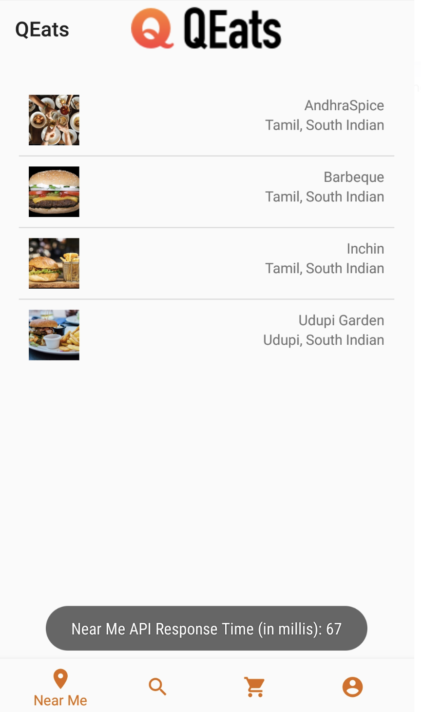
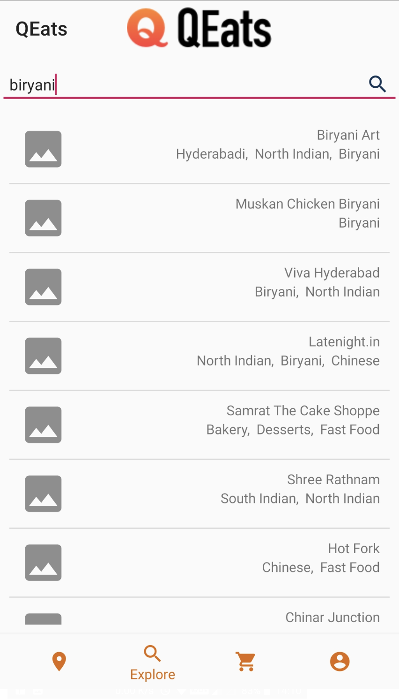
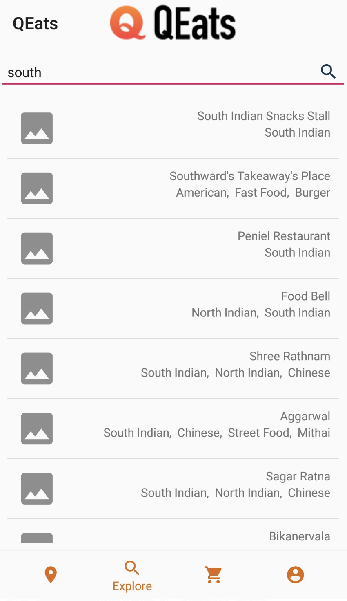
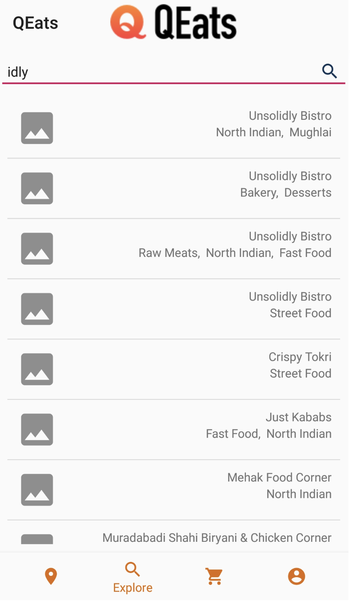

# Food Ordering Backend

## Overview
Built a distributed system backend food ordering app with **Java Spring Boot** and **MongoDB**. The system does caching using **Redis** and to further speed up database queries, they are run using **multi-threading**. We can easily deploy the solution to the Cloud using its **Docker** image that allows users to browse and order their favorite dishes from nearby restaurants. 
During the course of this project,

I had build different parts of the application backend which is a Spring Boot application.
Several REST API endpoints were implemented to query restaurant information and place food orders.
To give a sense of real-world problems, production issues were investigated using Scientific Debugging methods.
Along with this, I improved the app performance under large load scenarios as well as included an advanced search feature in the app. 

## Retrieved restaurant data for a given user location
### Scope of Work
Implemented GET /API/v1/restaurants and the corresponding request handler and response methods.
Used Mockito to enable the development of the relevant MVCS layers independently.
Retrieved a list of restaurants from MongoDB based on a user location.

### Skills used
Spring Boot, Spring Data, REST API, Jackson, Mockito, JUnit, MongoDB

## Replicated performance issues and solved them using caching strategies
### Scope of Work
Employed JMeter or load testing to expose performance issues.
Identified DB queries contributing to degradation in performance.
Used a Redis cache to alleviate read performance.

### Skills used
Redis, JMeter

https://github.com/user-attachments/assets/a970ccb0-413d-44fa-b6c6-d03e17cd13a7

## Performed search operations using custom attributes
### Scope of Work
Used MongoDB queries to enable users to search for restaurants using attributes like name, cuisine, dish, and price.
Used multithreading to increase the number of concurrent searches that can be performed.

### Skills used
MongoDB querying, Multithreading

